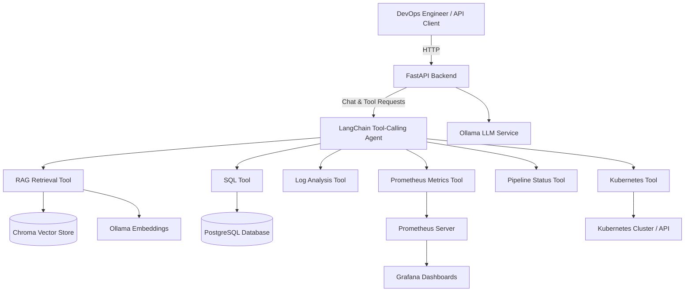

# AI DevOps Assistant

Production-style open-source platform demonstrating **AI Engineering + DevOps + Platform Architecture** for interview portfolios.

It runs locally with open-source components, uses a local LLM through Ollama, and showcases practical SRE/DevSecOps workflows.

## What This Project Demonstrates

- **AI agent orchestration**: LangChain tool-calling agent that routes requests to SQL, Kubernetes, log, metrics, and pipeline tools.
- **Operational diagnostics**: Root-cause style analysis for CI/CD failures, infra incidents, and deployment issues.
- **RAG for DevOps**: Retrieval pipeline over docs/runbooks stored in Chroma.
- **Observability integration**: Prometheus + Grafana for metrics, dashboards, and troubleshooting flows.
- **DevSecOps discipline**: linting, testing, Docker build validation, dependency scanning, SAST, and container scanning in CI.

## Architecture

This project follows a service-oriented architecture where the AI assistant, observability stack, database, and model runtime are split into separate containers or pods. The backend acts as the API entry point and orchestrates tool-calling through the LangChain agent.



### Runtime Components

The platform is designed to run as a set of cooperating services. In Docker Compose the main containers are:

- `ai-devops-backend`: The FastAPI application and LangChain agent that handles requests, routes tool calls, executes safe SQL, queries Prometheus and Kubernetes, and returns conversational responses.
- `ai-devops-ollama`: The local LLM server running Ollama. It provides model inference for prompt completion, tool selection, and RAG synthesis.
- `ai-devops-postgres`: The PostgreSQL relational database storing metadata, logs, pipeline information, and structured application data.
- `ai-devops-prometheus`: The Prometheus time-series server that scrapes metrics from the backend, Ollama, and other services.
- `ai-devops-grafana`: The Grafana dashboard service used for visualizing Prometheus metrics and operational health.
- `ai-devops-redis`: An optional Redis cache service for transient data and performance-sensitive caching.
- `ai-devops-chroma`: The Chroma vector store service used for semantic search and retrieval-augmented generation (RAG).

In Kubernetes, these services map to pods/deployments as follows:

- `ai-devops-assistant`: The main backend deployment running the FastAPI service.
- `ollama`: The Ollama LLM deployment serving local model inference.
- `postgres`: The PostgreSQL deployment storing application data.
- `chroma`: The Chroma vector database deployment for embeddings and document search.
- `prometheus`: The Prometheus deployment scraping metrics from the application and cluster.
- `grafana`: The Grafana deployment providing dashboards and data visualization.

### What Each Pod / Container Does

- `ai-devops-backend` / `ai-devops-assistant`
  - Exposes the `/chat`, `/run_sql`, `/analyze_logs`, `/metrics`, and `/health` endpoints.
  - Manages request validation, tool orchestration, configuration, and logging.
  - Calls the agent layer to decide whether to use SQL, K8s, logs, metrics, or RAG to answer the user.

- `ai-devops-ollama` / `ollama`
  - Hosts the local Ollama inference engine.
  - Responds to prompt completions and tool-calling decisions.
  - Stores downloaded models in persistent storage so the assistant can use them offline.

- `ai-devops-postgres` / `postgres`
  - Stores structured state for the assistant, including pipeline records, logs, and operational metadata.
  - Serves as the primary relational database for SQL tool queries.

- `ai-devops-chroma` / `chroma`
  - Stores semantic embeddings and document vectors.
  - Powers retrieval of runbooks, documentation, and contextual knowledge for RAG-enhanced answers.

- `ai-devops-prometheus` / `prometheus`
  - Scrapes metrics from the backend service and supported endpoints.
  - Stores time-series metrics for dashboards and analysis.
  - Enables queries such as HTTP latency, error rate, and resource health.

- `ai-devops-grafana` / `grafana`
  - Visualizes metrics from Prometheus.
  - Provides preconfigured dashboards for service health, request performance, and cluster monitoring.

- `ai-devops-redis`
  - Optional cache layer used for temporary tool results and accelerated runtime performance.
  - Helps reduce repeated work for repeated queries.

## Tech Stack

- **Backend**: Python, FastAPI, SQLAlchemy
- **AI**: LangChain, tool-calling agents, RAG, Chroma
- **LLM**: Ollama (`llama3`, `mistral`, `nomic-embed-text`)
- **Data**: PostgreSQL
- **Observability**: Prometheus, Grafana
- **Platform**: Docker, Docker Compose, Kubernetes manifests
- **CI/CD & Security**: GitHub Actions, Ruff, Black, MyPy, Pytest, Bandit, pip-audit, Trivy

## Repository Layout

```text
ai_devops_assistant/
  agents/ tools/ rag/ database/ services/ api/
infra/
  kubernetes/
    helm/           # Helm chart for Kubernetes deployment
    *.yaml          # Individual Kubernetes manifests
monitoring/
  prometheus/ grafana/
tests/
.github/workflows/     # GitHub Actions CI/CD
azure-pipelines.yml    # Azure DevOps pipeline
Jenkinsfile           # Jenkins pipeline
```

## Quick Start (Docker)

```bash
git clone https://github.com/yourusername/ai-devops-assistant.git
cd ai-devops-assistant
cp .env.example .env
docker compose up -d
docker exec ai-devops-ollama ollama pull llama3
docker exec ai-devops-ollama ollama pull nomic-embed-text
curl -s http://localhost:8000/health
```

Endpoints:
- API docs: `http://localhost:8000/docs`
- Prometheus: `http://localhost:9090`
- Grafana: `http://localhost:3000` (admin/admin)

## Interview Demo Script (High-Signal)

### Demo Path A: Docker-based (10-15 min)

```bash
# 1) Start platform
docker compose up -d
docker compose ps

# 2) Verify health and observability
curl -s http://localhost:8000/health
curl -s "http://localhost:9090/api/v1/query?query=up"

# 3) Ask operational AI questions
curl -X POST http://localhost:8000/chat \
  -H "Content-Type: application/json" \
  -d '{"message":"Why did my pipeline fail?"}'

curl -X POST http://localhost:8000/chat \
  -H "Content-Type: application/json" \
  -d '{"message":"Which service has the highest latency?"}'

# 4) Show SQL safety controls
curl -X POST http://localhost:8000/run_sql \
  -H "Content-Type: application/json" \
  -d '{"query":"SELECT * FROM application_logs LIMIT 5"}'

# 5) Show blocked unsafe query
curl -X POST http://localhost:8000/run_sql \
  -H "Content-Type: application/json" \
  -d '{"query":"DROP TABLE application_logs"}'
```

### Demo Path B: Kubernetes + Minikube (Platform Skills)

```bash
# 1) Start local cluster
minikube start --cpus=4 --memory=8192

# 2) Apply namespace first, then deploy stack manifests
kubectl apply -f infra/kubernetes/namespace.yaml
kubectl apply -f infra/kubernetes/
kubectl get pods -n ai-devops-assistant

# 3) Ensure model exists in in-cluster Ollama
OLLAMA_POD=$(kubectl get pod -n ai-devops-assistant -l app=ollama -o jsonpath='{.items[0].metadata.name}')
kubectl exec -n ai-devops-assistant "$OLLAMA_POD" -- ollama pull llama3

# 4) Validate rollout + runtime health
kubectl rollout status deploy/ai-devops-assistant -n ai-devops-assistant

# Temporary port-forward for API checks
kubectl port-forward svc/ai-devops-assistant 8000:80 -n ai-devops-assistant
curl -s http://localhost:8000/health

# 5) Trigger AI troubleshooting
curl -X POST http://localhost:8000/chat \
  -H "Content-Type: application/json" \
  -d '{"message":"Show failing pods and explain likely root cause"}'
```

## Security Skills Showcase

- SQL guardrails: only safe read-style SQL accepted by tool layer.
- Secret hygiene: env-based configuration; no plaintext credentials in code.
- CI checks:
  - `bandit` for static security analysis.
  - `pip-audit` for dependency CVEs.
  - `trivy` for filesystem/container vulnerability scanning.
- Supply chain posture: deterministic Docker builds, non-root runtime container.

## CI/CD Pipeline Stages

GitHub Actions pipeline includes:
- **lint**: Ruff + Black + MyPy
- **unit-tests**: pytest + coverage
- **docker-build**: image build validation
- **security-scan**: Bandit + pip-audit + Trivy (SARIF upload)

## Deployment Options

### GitHub Actions (Already Configured)

The repository includes GitHub Actions workflows in `.github/workflows/`:

- `ci-cd.yml`: Main CI pipeline with linting, testing, Docker build, and security scanning
- `release.yml`: Automated Docker image building and publishing to GitHub Container Registry
- `security.yml`: Scheduled security scans with Trivy and CodeQL
- `dependency-review.yml`: Dependency vulnerability checking

**To use GitHub Actions:**
1. Push your code to a GitHub repository
2. Ensure GitHub Container Registry is enabled
3. The workflows will run automatically on push/PR to main/develop branches

### Azure DevOps Pipelines

Create a new pipeline using the provided `azure-pipelines.yml`:

1. In Azure DevOps, go to Pipelines → New Pipeline
2. Select "GitHub" as source and connect your repository
3. Choose "Existing Azure Pipelines YAML file"
4. Select `azure-pipelines.yml` from the root
5. Configure these variables in Pipeline Variables:
   - `DOCKER_REGISTRY`: Your Azure Container Registry URL
   - Set up service connections for Azure Container Registry and Kubernetes

### Jenkins Pipeline

Use the provided `Jenkinsfile` for Jenkins:

1. Install required Jenkins plugins:
   - Docker Pipeline
   - Kubernetes CLI
   - Cobertura (for coverage reports)
   - JUnit (for test reports)

2. Configure Jenkins credentials:
   - `docker-registry-credentials`: For pushing to your container registry
   - `kubeconfig`: For Kubernetes deployment

3. Create a new Pipeline job and copy the `Jenkinsfile` content

4. Configure the environment variables in the Jenkins job:
   - `DOCKER_REGISTRY`: Your container registry URL

### Deployment to Kubernetes

After CI/CD completes successfully:

```bash
# Using kubectl directly
kubectl apply -f infra/kubernetes/namespace.yaml
kubectl apply -f infra/kubernetes/

# Or using Helm (if available)
helm install ai-devops-assistant infra/kubernetes/helm/

# Check deployment status
kubectl get pods -n ai-devops-assistant
kubectl rollout status deployment/ai-devops-assistant -n ai-devops-assistant
```

### Production Considerations

- **Secrets Management**: Use your CI/CD platform's secret management (GitHub Secrets, Azure Key Vault, Jenkins Credentials)
- **Environment Variables**: Configure database URLs, API keys, and registry credentials
- **Scaling**: Adjust replica counts in Kubernetes manifests based on load
- **Monitoring**: Set up alerts for pipeline failures and deployment issues
- **Rollback**: Implement blue-green or canary deployment strategies for production

## API Examples

```bash
curl -X POST http://localhost:8000/analyze_logs \
  -H "Content-Type: application/json" \
  -d '{"query":"ERROR","time_range_hours":24,"limit":50}'

curl -X POST http://localhost:8000/metrics \
  -H "Content-Type: application/json" \
  -d '{"query":"histogram_quantile(0.95, sum(rate(http_request_duration_seconds_bucket[5m])) by (le))"}'
```

## Running Demo Checks

Validate your deployment with automated checks:

```bash
# Method 1: Using Python directly
python3 demo_checks.py

# Method 2: Using shell wrapper (handles venv activation)
bash run_demo_checks.sh
```

### Expected Results

#### Demo Path A: Docker Deployment

When running demo checks after `docker compose up -d`:

```
✓ Docker daemon is running
✓ Found 8 AI DevOps container(s) running
  - ai-devops-api
  - ai-devops-ollama
  - ai-devops-postgres
  - ai-devops-chroma
  - ai-devops-prometheus
  - ai-devops-grafana
  ...

✓ General health: 200
✓ Liveness probe: 200
✓ Readiness probe: 200
  Status: ready

✓ /chat endpoint: OK (200)
  Response: Based on current metrics...

✓ /analyze_logs endpoint: OK (200)
✓ /metrics endpoint: OK (200)
✓ Prometheus: OK
✓ Grafana: OK
✓ All unit tests passed
```

**What it means:**
- All containers are running and healthy
- API is responding to requests
- Chat/LLM functionality is working (Ollama model available)
- Prometheus is collecting metrics
- Grafana is accessible for visualization
- Core functionality tests pass

#### Demo Path B: Kubernetes Deployment

When running demo checks after `kubectl apply -f infra/kubernetes/`:

```
✓ Connected to Kubernetes cluster
  Version: v1.28.0

✓ Namespace 'ai-devops-assistant' exists

✓ Found 6 pod(s) in namespace
  - ai-devops-assistant-<hash>: Running
  - ollama-<hash>: Running
  - postgres-<hash>: Running
  - chroma-<hash>: Running
  - prometheus-<hash>: Running
  - grafana-<hash>: Running

✓ Found 4 deployment(s)

✓ General health: 200
✓ Liveness probe: 200
✓ Readiness probe: 200
```

**What it means:**
- Kubernetes cluster is accessible
- All required resources are deployed in the namespace
- Pods are in Running state
- API is responding through Kubernetes service

### Demo Check Components

| Check | Purpose | Success Indicator |
|-------|---------|-------------------|
| **Deployment Detection** | Identify Docker or Kubernetes | One method detected with running services |
| **Container/Pod Status** | Verify all components running | All containers/pods in Running state |
| **Health Endpoints** | API responsiveness | 200 status code on all /health/* paths |
| **Chat Endpoint** | LLM integration | 200 response with content |
| **Log Analysis** | Database connectivity | 200 or 400 (expected if no logs) |
| **Metrics Endpoint** | Prometheus integration | 200 response with data |
| **Observability Stack** | Monitoring availability | Prometheus and Grafana accessible |
| **Unit Tests** | Core functionality | All tests pass |

### Troubleshooting Demo Checks

**"No AI DevOps deployment detected"**
- For Docker: Run `docker compose up -d` in the repo root
- For Kubernetes: Run `kubectl apply -f infra/kubernetes/` 

**"API Health Checks: Connection refused"**
- For Docker: Ensure containers are running (`docker ps`)
- For Kubernetes: Port-forward with `kubectl port-forward svc/ai-devops-assistant 8000:80`

**"/chat endpoint: Timeout"**
- Normal during first LLM inference (model loading)
- Ollama is running but model initialization takes 30+ seconds
- Try again after waiting for model to load

**"Unit tests failed"**
- Ensure virtual environment is activated: `source venv/bin/activate`
- Install dev dependencies: `pip install -r requirements.txt`

## Local Development

```bash
python -m venv venv
source venv/bin/activate
pip install -r requirements.txt
pip install -e ".[dev]"
pre-commit install
pytest tests/unit -v
```

## Documentation

- `ARCHITECTURE.md`
- `IMPLEMENTATION_PLAN.md`
- `infra/kubernetes/README.md`
