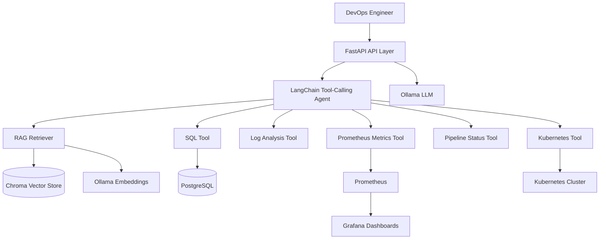

# AI DevOps Assistant

Production-style open-source platform demonstrating **AI Engineering + DevOps + Platform Architecture** for interview portfolios.

It runs locally with open-source components, uses a local LLM through Ollama, and showcases practical SRE/DevSecOps workflows.

## What This Project Demonstrates

- **AI agent orchestration**: LangChain tool-calling agent that routes requests to SQL, Kubernetes, log, metrics, and pipeline tools.
- **Operational diagnostics**: Root-cause style analysis for CI/CD failures, infra incidents, and deployment issues.
- **RAG for DevOps**: Retrieval pipeline over docs/runbooks stored in Chroma.
- **Observability integration**: Prometheus + Grafana for metrics, dashboards, and troubleshooting flows.
- **DevSecOps discipline**: linting, testing, Docker build validation, dependency scanning, SAST, and container scanning in CI.

## Architecture



## Tech Stack

- **Backend**: Python, FastAPI, SQLAlchemy
- **AI**: LangChain, tool-calling agents, RAG, Chroma
- **LLM**: Ollama (`llama3`, `mistral`, `nomic-embed-text`)
- **Data**: PostgreSQL
- **Observability**: Prometheus, Grafana
- **Platform**: Docker, Docker Compose, Kubernetes manifests
- **CI/CD & Security**: GitHub Actions, Ruff, Black, MyPy, Pytest, Bandit, pip-audit, Trivy

## Repository Layout

```text
ai_devops_assistant/
  agents/ tools/ rag/ database/ services/ api/
infra/
  kubernetes/
monitoring/
  prometheus/ grafana/
tests/
.github/workflows/
```

## Quick Start (Docker)

```bash
git clone https://github.com/yourusername/ai-devops-assistant.git
cd ai-devops-assistant
cp .env.example .env
docker compose up -d
docker exec ai-devops-ollama ollama pull llama3
docker exec ai-devops-ollama ollama pull nomic-embed-text
curl -s http://localhost:8000/health
```

Endpoints:
- API docs: `http://localhost:8000/docs`
- Prometheus: `http://localhost:9090`
- Grafana: `http://localhost:3000` (admin/admin)

## Interview Demo Script (High-Signal)

### Demo Path A: Docker-based (10-15 min)

```bash
# 1) Start platform
docker compose up -d
docker compose ps

# 2) Verify health and observability
curl -s http://localhost:8000/health
curl -s "http://localhost:9090/api/v1/query?query=up"

# 3) Ask operational AI questions
curl -X POST http://localhost:8000/chat \
  -H "Content-Type: application/json" \
  -d '{"message":"Why did my pipeline fail?"}'

curl -X POST http://localhost:8000/chat \
  -H "Content-Type: application/json" \
  -d '{"message":"Which service has the highest latency?"}'

# 4) Show SQL safety controls
curl -X POST http://localhost:8000/run_sql \
  -H "Content-Type: application/json" \
  -d '{"query":"SELECT * FROM application_logs LIMIT 5"}'

# 5) Show blocked unsafe query
curl -X POST http://localhost:8000/run_sql \
  -H "Content-Type: application/json" \
  -d '{"query":"DROP TABLE application_logs"}'
```

### Demo Path B: Kubernetes + Minikube (Platform Skills)

```bash
# 1) Start local cluster
minikube start --cpus=4 --memory=8192
kubectl create namespace ai-devops-assistant || true

# 2) Deploy stack manifests
kubectl apply -f infra/kubernetes/
kubectl get pods -n ai-devops-assistant

# 3) Port-forward key services
kubectl port-forward svc/ai-devops-assistant 8000:8000 -n ai-devops-assistant
kubectl port-forward svc/prometheus 9090:9090 -n ai-devops-assistant
kubectl port-forward svc/grafana 3000:3000 -n ai-devops-assistant

# 4) Validate rollout + runtime health
kubectl rollout status deploy/ai-devops-assistant -n ai-devops-assistant
curl -s http://localhost:8000/health

# 5) Trigger AI troubleshooting
curl -X POST http://localhost:8000/chat \
  -H "Content-Type: application/json" \
  -d '{"message":"Show failing pods and explain likely root cause"}'
```

## Security Skills Showcase

- SQL guardrails: only safe read-style SQL accepted by tool layer.
- Secret hygiene: env-based configuration; no plaintext credentials in code.
- CI checks:
  - `bandit` for static security analysis.
  - `pip-audit` for dependency CVEs.
  - `trivy` for filesystem/container vulnerability scanning.
- Supply chain posture: deterministic Docker builds, non-root runtime container.

## CI/CD Pipeline Stages

GitHub Actions pipeline includes:
- **lint**: Ruff + Black + MyPy
- **unit-tests**: pytest + coverage
- **docker-build**: image build validation
- **security-scan**: Bandit + pip-audit + Trivy (SARIF upload)

## API Examples

```bash
curl -X POST http://localhost:8000/analyze_logs \
  -H "Content-Type: application/json" \
  -d '{"query":"ERROR","time_range_hours":24,"limit":50}'

curl -X POST http://localhost:8000/metrics \
  -H "Content-Type: application/json" \
  -d '{"query":"histogram_quantile(0.95, sum(rate(http_request_duration_seconds_bucket[5m])) by (le))"}'
```

## Local Development

```bash
python -m venv venv
source venv/bin/activate
pip install -r requirements.txt
pip install -e ".[dev]"
pre-commit install
pytest tests/unit -v
```

## Documentation

- `ARCHITECTURE.md`
- `IMPLEMENTATION_PLAN.md`
- `infra/kubernetes/README.md`

## License

MIT
